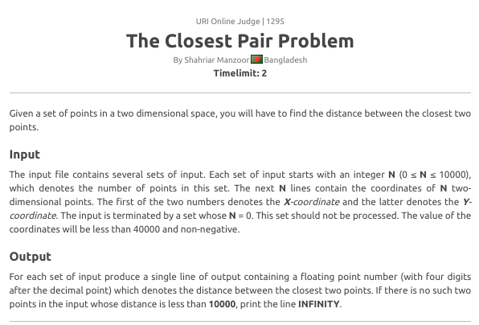
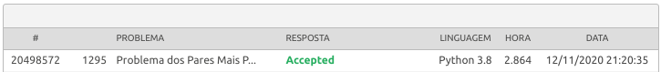

# The closest pair problem

**Número da Lista**: Não se aplica 
**Conteúdo da Disciplina**: Dividir e conquistar 

## Alunos
|Matrícula | Aluno |
| -- | -- |
| 15/0009011 |  Elias Bernardo |
| 17/0141161  |  Erick Giffoni |

 

## Sobre 

Para esse projeto decidimos resolver um problema de programação que envolve o algoritmo de Dividir e conquistar. Trata-se de encontrar a menor distância entre um par de pontos ( de coordenadas bidimensionais ) num conjunto finito. Para tanto é necessário encontrar a mediana entre esses pontos, bem como resolver esse problema dividindo-o ao meio de forma recursiva. Depois combina-se essas partes e encontra-se a menor distância.

O problema está disponível na plataforma de problemas de computação __URI (Online Judge)__ por meio deste [link](https://www.urionlinejudge.com.br/judge/pt/problems/view/1295) e também como um pdf na pasta problemas/ deste repositório.

## Screenshots

### Descrição do problema

### Submissão aceita

## Instalação 
**Linguagem**: Python (3.8) 

## Uso 

Assista ao vídeo pelo YouTube no link [https://youtu.be/JCgeDAESMM8](https://youtu.be/JCgeDAESMM8) ou baixe o vídeo na pasta __img/__.

### Requisitos para utilizar esse projeto

- conexão de internet; 
- navegador web de escolha livre; 
- terminal/console/shell no computador; 
- python 3.8 ou superior; 
- clonar o projeto;

> Para clonar o projeto digite:

    git clone https://github.com/projeto-de-algoritmos/D-C_Closest_pair_problem.git

### Executando localmente

1. Abra um terminal; 
2. Entre na pasta src/;
3. Execute o comando python (pode variar de acordo com o sistema operacional) e insira a entrada:
4. __python closest_pair.py__;
5. Caso queira utilizar a entrada do repositório digite ___python closest_pair.py < in.txt__;

### Enviando para o URI

Caso prefira enviar diretamente para o URI, selecione e copie todo o conteúdo do arquivo __closest_pair.py__ e siga os passos a seguir:

1. Logue-se ou registre-se;
2. Entre no link do desafio: [https://www.urionlinejudge.com.br/judge/pt/problems/view/1295](https://www.urionlinejudge.com.br/judge/pt/problems/view/1295);
3. Selecione a linguagem __Python 3.8__ (há uma opção Python, porém ela deve ser selecionada);
4. Cole o código no local indicado (source code)
5. Clique em __enviar__ e aguarde o resultado

## Problemas ? Sugestões ?

Caso você tenha alguma dificuldade, sugestão ou algum problema com o projeto, 
por favor entre em contato conosco:

- Elias Bernardo - ebmm01@gmail.com - telegram @ebmm01
- Erick Giffoni - giffoni.erick@gmail.com - telegram @ErickGiffoni 
